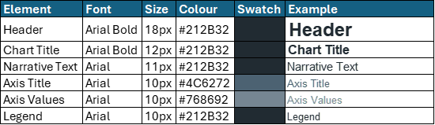

# Branding & Visual Identity

**A cohesive visual identity is essential to building trust and recognisability. All analytical products should follow the [NHS brand guidance](https://www.england.nhs.uk/nhsidentity/identity-guidelines/colours/), adapted to the I&I South West context.**

 87% of people spontaneously recall **NHS Blue** and **White** — using them consistently reinforces trust and brand recognition.

---

## Colour Palette

Use the standard NHS palette consistently across dashboards, reports, and slides.

## Chart Colour Convention by Organisatio

Use consistent colour and line styles across products for comparability.

*A reference table outlining the correct colour is included below*

{data-title="Diagram of SW HEX colours" data-caption-position="top"}

---

## Typography

Follow NHS font and sizing conventions to support clarity and accessibility.

Use **bold** headers, maintain consistent spacing, and limit fonts to Arial only.

*A reference table outlining the correct font is included below*

{data-title="Diagram of typography formatting" data-caption-position="top"}

