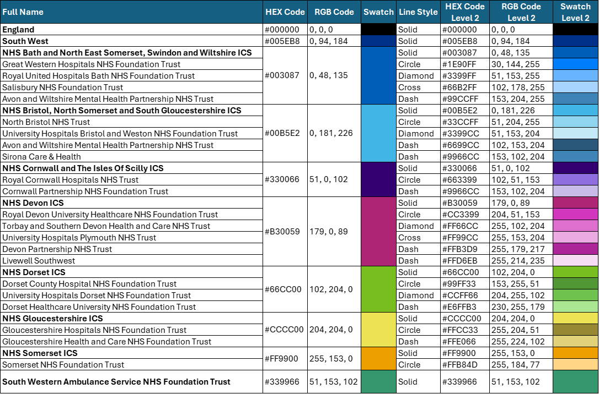

# Branding & Visual Identity

**A cohesive visual identity is essential to building trust and recognisability. All analytical products should follow the [NHS brand guidance](https://data-viz.nhs.uk/), adapted to the I&I South West context.**

 87% of people spontaneously recall **NHS Blue** and **White** — using them consistently reinforces trust and brand recognition.

---

## Colour Palette

Use the standard NHS palette consistently across dashboards, reports, and slides.

*A reference table outlining the correct colour is included below*

{data-title="Diagram of SW HEX colours" data-caption-position="top"}

---

## Chart Colour Convention by Organisation

Use consistent colour and line styles across products for comparability.

| Organisation / Region | Hex | Style | Colour Label |
|------------------------|------|--------|---------------|
| England | `#000000` | Solid | Black |
| South West | `#005EB8` | Solid | NHS Blue |
| BNSSG ICB | `#4C6272` | Solid | Bluish Green |
| BSW ICB | `#41B6E6` | Solid | NHS Light Blue |
| Cornwall ICB | `#FFB81C` | Solid | Yellow |
| Devon ICB | `#AE2573` | Solid | Sky Blue |
| Dorset ICB | `#00A499` | Solid | Dark Blue |
| Gloucestershire ICB | `#E317AA` | Solid | Gray |
| Somerset ICB | `#007F3B` | Solid | Green |
| South Western Ambulance | `#9A6324` | Solid | Grape |

>  Use dashed/dotted variants for multiple organisations within the same colour group.

---

## Typography

Follow NHS font and sizing conventions to support clarity and accessibility.

| Element | Font | Size | Colour |
|--------|------|------|--------|
| Header | Arial Bold | 18px | `#212B32` |
| Chart Title | Arial Bold | 12px | `#212B32` |
| Narrative Text | Arial | 11px | `#212B32` |
| Axis Title | Arial | 10px | `#4C6272` (NHS Grey 1) |
| Axis Values | Arial | 10px | `#768692` (NHS Grey 3) |
| Legend | Arial | 10px | `#212B32` |

Use **bold** headers, maintain consistent spacing, and limit fonts to Arial only.

---

## Layout Principles

Follow **Z-pattern layout** — top-left → top-right → bottom-left → bottom-right — to align with natural reading flow.

-  **Logo**: Always place the NHS logo at the **top-right** of the dashboard  
  Size: `100px × 40px`
-  **Narrative**: Place to the **right** of charts wherever applicable
-  **Spacing**: Use even padding and margins to group visual elements
-  **Visual Hierarchy**: Emphasise key insights and headers through size and positioning

---

For full guidance, see the [Data Viz Community of Practice](https://data-viz.nhs.uk/) or speak to the South West I&I design leads.
