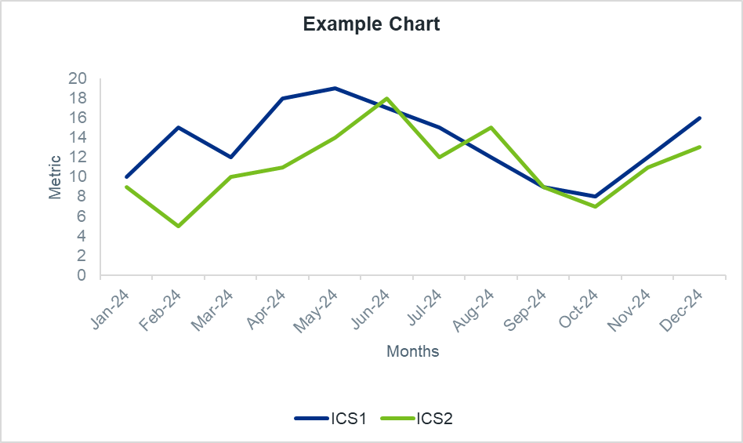

# Charts vs Tables

Choosing the correct visual is paramount to **increasing understanding and deriving insights for stakeholders**. A well-selected and properly formatted visual can convey complex information far more effectively than raw data or poorly designed charts.

The fundamental decision often lies between presenting data in a table or a chart.

**Tables are excellent when:**

You need to display precise values

The audience needs to look up individual figures

You have multiple units of measure

The dataset is relatively small

The primary goal is to compare individual data points rather than overall trends

**Charts are ideal when:**

You want to show trends, patterns, or relationships in the data

The goal is to provide a quick overview and identify outliers

You are dealing with larger datasets where individual values are less important than the overall story

The audience needs to grasp insights quickly without deep analysis of numbers

{data-title="Decision-making process between tables and charts" data-caption-position="top"}

---

### Visual Basics: Essential Elements for Every Chart
 
No matter the chart type, every visual you create needs these core elements for clarity and consistency:

**Chart Title:** Give every chart a clear, concise, and descriptive title right at the top. It should tell your audience exactly what they're looking at.

**Axis Labels:** Make sure all axes are clearly labeled with values (numbers, dates, categories). This helps stakeholders quickly grasp the data's scale and context.

**Axis Titles:** Each axis needs a descriptive title explaining what's being measured (e.g., "Date", "Users"). This is crucial for correct interpretation.

**Legend** (if needed): If your chart shows multiple data series or categories, a legend is a must. It clarifies what each color, symbol, or pattern represents. By default, place legends below the chart for best readability and to avoid blocking the data.

**Consistent Colors:** All colors in your charts, especially for categories or highlights, must align with the [RAG Rating](rag_rating.md) and any other defined palettes in [Branding & Visual Identity](branding_visual.md). This keeps things consistent and professional across all our work.
 
*A chart example is included below*

 {data-title="Example Chart" data-caption-position="top"}

