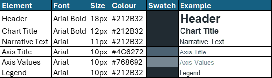

# Governance & Updates

 
**A style guide is a living document that needs to evolve with our team, tools, and best practices. This section outlines the processes for maintaining the guide, ensuring its accuracy, relevance, and continued improvement. Clear governance ensures that the guide remains a valuable and trusted resource for everyone.**

---

### Change Log
 
**Version Control:** Maintain a detailed change log that documents all updates, revisions, and additions to the style guide. This provides transparency and allows team members to quickly see what has changed and when.

---

### Process for Proposing Updates
 
**Continuous Improvement:** Establish a clear and accessible process for all team members to propose new guidelines, suggest amendments to existing ones, or recommend improvements to the style guide itself. This fosters a culture of collective ownership and continuous improvement.

---
 
### Maintainers/Owners
 
**Accountability:** Clearly identify the individuals or specific team responsible for the ongoing maintenance, regular review, and ultimate ownership of this style guide. This ensures accountability and a dedicated resource for questions and updates.
 

**A cohesive visual identity is essential to building trust and recognisability. All analytical products should follow the [NHS brand guidance](https://www.england.nhs.uk/nhsidentity/identity-guidelines/colours/), adapted to the I&I South West context.**

 87% of people spontaneously recall **NHS Blue** and **White** — using them consistently reinforces trust and brand recognition.

---

## Colour Palette and Chart Colour Convention by Organisation

Use the standard NHS palette consistently across dashboards, reports, and slides.

Use consistent colour and line styles across products for comparability.

*A reference table outlining the correct colour is included below*

{data-title="Diagram of SW HEX colours" data-caption-position="top"}

---

## Typography

Follow NHS font and sizing conventions to support clarity and accessibility.

Use **bold** headers, maintain consistent spacing, and limit fonts to Arial only.

*A reference table outlining the correct font is included below*

{data-title="Diagram of typography formatting" data-caption-position="top"}

