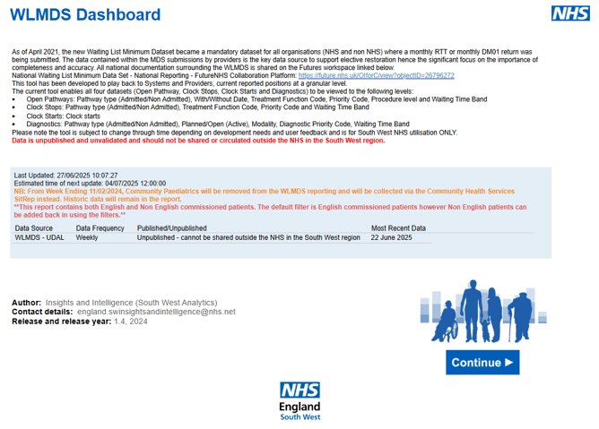
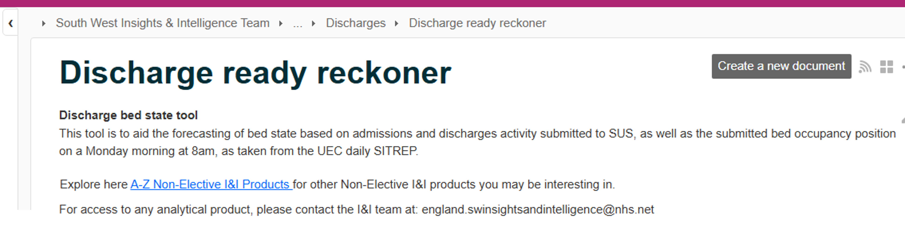

# Core Components of Any Reporting Product
Regardless of the platform or tool used, all analytical products should include the following core components to ensure clarity, transparency, and usability:

## Cover Page
**This section provides essential context and metadata about the product:** 

**Purpose:** What is the product designed to address or inform?

**Sharing Restrictions:** Can the product be shared outside of NHSE?

**Data Sources:** What data sources are used within the product?

**Last Refresh Date:** When was the data last updated?

**Key Contacts:** Who can be contacted for more information?

**Version Information:** What version of the product is this?

**Guidance Link:** Link to any user guide or supporting documentation

**Programme Area Linking:** Include the relevant link to each I&I product programe area

(*An example shown below*)

{data-title="WLMDS Cover Page Example" data-caption-position="top"}

---

### Main Report Content
**The core content of the product, typically organised as:**

**Overview Page/Tab:** Highlights key insights or summary observations from the data

**Focused Pages/Tabs:** Provide deeper dives into specific areas or themes

---

### Metric and Metadata Descriptions

Each metric or KPI used in the product should be clearly defined and documented here (or include a link to a separate metric reference document)

---

### Data Quality/Submission Compliance

If the product uses SitRep or submission-based data, it should include or link to a submission compliance or data quality report. This promotes transparency in interpretation

---

### Coding

A link to the relevant GitHub repository where the underlying code and logic for the product are maintained

---

### Product Navigation

All routine analytical products should be made available on the [NHS Futures page](https://future.nhs.uk/connect.ti/SouthWestAnalytics/view?objectID=1125188) under the relevant I&I programme area. They should also be recorded within the [Product A–Z](https://future.nhs.uk/connect.ti/SouthWestAnalytics/view?objectID=1125188) on NHS.

**Product Description:** Every product should include a clear description outlining its purpose and the frequency of updates on the NHS Futures product page

(*As per example shown below*)

{data-title="Futures Product Description Example" data-caption-position="top"}

**Programme Area Linking:** When adding a product description, include a link from the A–Z that directs users to other products in the same programme area. Use the relevant link from the table below of programme areas. 

| Programme Area                              | Link |
|---------------------------------------------|------|
| Community                                   | [View Community Products](https://future.nhs.uk/SouthWestAnalytics/viewDatastore?dsid=1125188&adv=s&datViewmode=list&search_2=3) |
| Data Quality                                | [View Data Quality Products](https://future.nhs.uk/SouthWestAnalytics/viewDatastore?dsid=1125188&adv=s&datViewmode=list&search_2=8) |
| Elective                                    | [View Elective Products](https://future.nhs.uk/SouthWestAnalytics/viewDatastore?dsid=1125188&adv=s&datViewmode=list&search_2=1) |
| Health Inequalities                         | [View Health Inequalities Products](https://future.nhs.uk/SouthWestAnalytics/viewDatastore?dsid=1125188&adv=s&datViewmode=list&search_2=12) |
| Infrastructure / Technology & Estates       | [View Infrastructure / Technology & Estates Products](https://future.nhs.uk/SouthWestAnalytics/viewDatastore?dsid=1125188&adv=s&datViewmode=list&search_2=9) |
| Learning Disabilities                       | [View Learning Disabilities Products](https://future.nhs.uk/SouthWestAnalytics/viewDatastore?dsid=1125188&adv=s&datViewmode=list&search_2=7) |
| Non Elective                                | [View Non Elective Products](https://future.nhs.uk/SouthWestAnalytics/viewDatastore?dsid=1125188&adv=s&datViewmode=list&search_2=2) |
| Population Health                           | [View Population Health Products](https://future.nhs.uk/SouthWestAnalytics/viewDatastore?dsid=1125188&adv=s&datViewmode=list&search_2=10) |
| Safeguarding                                | [View Safeguarding Products](https://future.nhs.uk/SouthWestAnalytics/viewDatastore?dsid=1125188&adv=s&datViewmode=list&search_2=11) |
| Workforce                                   | [View Workforce Products](https://future.nhs.uk/SouthWestAnalytics/viewDatastore?dsid=1125188&adv=s&datViewmode=list&search_2=5) |

