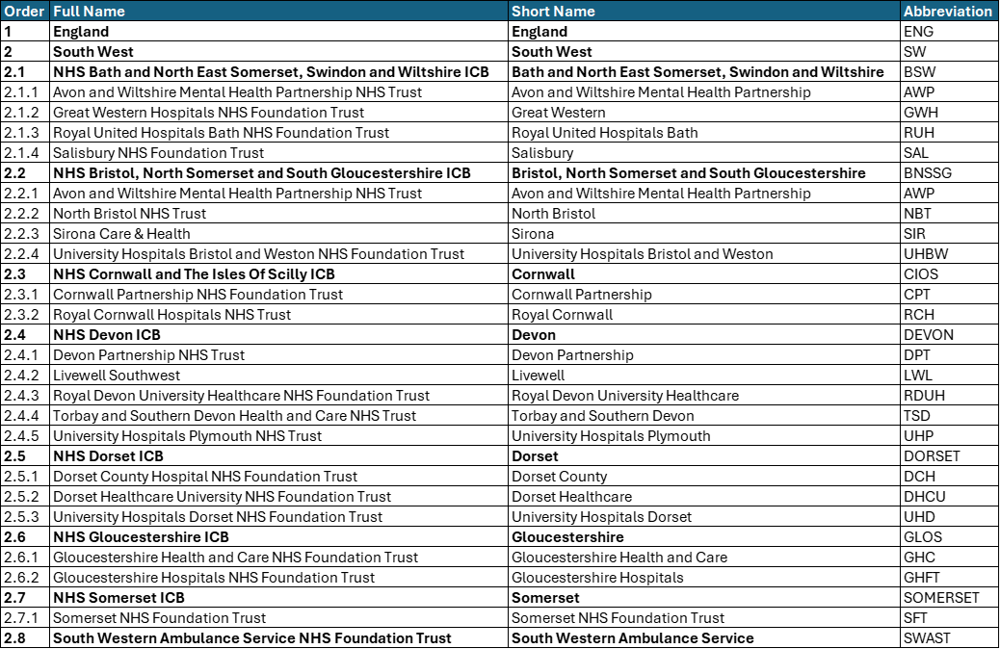

# Naming Conventions

**Consistency in naming and presentation is critical for clarity and usability across all analytical products**

**Abbreviations:**

Use consistent and approved abbreviations across all dashboards and reports. Avoid ad-hoc or unofficial naming

**Ordering:** 

When displaying multiple providers, always present them in a standard, agreed order to support comparison and alignment

*A reference table outlining the correct order and standard abbreviations for all providers is included below*

{data-title="Diagram of SW naming conventions" data-caption-position="top"}

