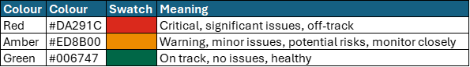

**Best Practice:**  
Where possible, products should use **Statistical Process Control (SPC)** to show variation over time. SPC is a powerful tool for distinguishing between normal fluctuation and meaningful change, supporting better decision-making and reducing overreaction to single data points.

For national guidance and methodology, refer to:  
[Making Data Count – NHS Improvement](https://www.england.nhs.uk/ourwork/qual-clin-lead/making-data-count/)

### When to Use SPC

SPC should be applied when:

- Time series data is available (typically ≥10 points)
- The product aims to identify improvement, deterioration, or stability
- Variation analysis is key to the product’s purpose

Where SPC is used, always include a brief explanation of what SPC is **by included a link to user-friendly SPC guidance**.  
_(Link to be provided.)_

*A table outlining how to interpret an SPC chart*

{data-title="Interpreting an SPC Chart" data-caption-position="top"}

### FDP Variation Logic
*An explainer on FDP Variation Logic for SPC*

{data-title="FDP Variation Logic" data-caption-position="top"}

---

## Alternatives to SPC

In some cases, SPC may not be appropriate or possible (e.g. too few data points, binary data). In these situations, use one of the following fallback methods to indicate change:

### Direction of Travel  
Where SPC isn’t used, adopt a simplified variation model using terms such as:

- Improved 
- Sustained  
- Deteriorated  

Logic for how these terms are applied should follow agreed internal rules. _(Link to be provided.)_

---

## RAG Rating

RAG (Red, Amber, Green) ratings are a simple yet effective way to visually **communicate the status or health of a metric, project, or task**. They provide an immediate understanding of what's on track, what needs attention, and what's at risk. To ensure consistency across all our products, please adhere to the following color palette:

*A reference table outlining the correct colour is included below*

{data-title="Diagram of RAG colours" data-caption-position="top"}

---
 
### When to Use RAG Ratings
 
RAG ratings should be used when you need to convey a quick, high-level status. This could include:
Project progress updates
Performance against key metrics (KPIs)
Risk assessments
Task completion status

---

### Enhancing RAG Ratings with Arrows
 
To provide even greater clarity and indicate trend, consider incorporating arrows alongside your RAG ratings. These arrows visually represent whether the status is improving, worsening, or remaining stable since the last reporting period.

*A reference table outlining the correct arrows to use is included below*

{data-title="Diagram of RAG arrows" data-caption-position="top"}

By consistently applying these RAG colors and utilising trend arrows, we can ensure that our data products are not only informative but also **immediately actionable**, enabling our stakeholders to quickly grasp the key takeaways
 

