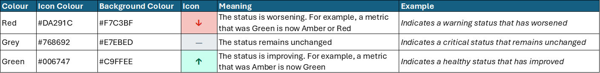

# RAG Rating

RAG (Red, Amber, Green) ratings are a simple yet effective way to visually **communicate the status or health of a metric, project, or task**. They provide an immediate understanding of what's on track, what needs attention, and what's at risk. To ensure consistency across all our products, please adhere to the following color palette:

*A reference table outlining the correct colour is included below*

{data-title="Diagram of RAG colours" data-caption-position="top"}

---
 
### When to Use RAG Ratings
 
RAG ratings should be used when you need to convey a quick, high-level status. This could include:
Project progress updates
Performance against key metrics (KPIs)
Risk assessments
Task completion status

---

### Enhancing RAG Ratings with Arrows
 
To provide even greater clarity and indicate trend, consider incorporating arrows alongside your RAG ratings. These arrows visually represent whether the status is improving, worsening, or remaining stable since the last reporting period.

*A reference table outlining the correct arrows to use is included below*

{data-title="Diagram of RAG arrows" data-caption-position="top"}

By consistently applying these RAG colors and utilising trend arrows, we can ensure that our data products are not only informative but also **immediately actionable**, enabling our stakeholders to quickly grasp the key takeaways
 

